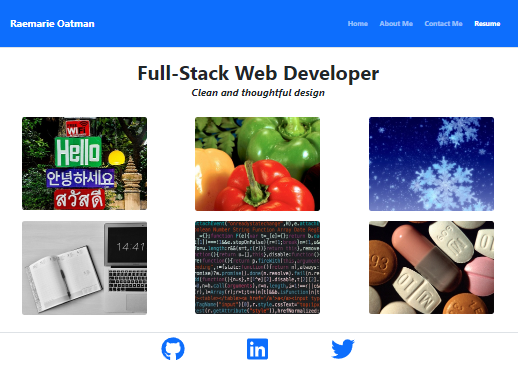

# REACT Portfolio

 

The Portfolio is deployed here:  https://rmoatman.github.io/oatman_react_portfolio/

 

## Description

This portfolio is a single-page React application.  It uses mobile-first design and many different libraries including fontawesome, axios, dotenv, gh-pages, react, react-bootstrap, react-router-dom, and react-spring.

 

## Table of Contents

- [Installation](#installation)
- [Usage](#usage)
- [License](#license)
- [Collaborators](#collaborators)
- [Questions](#questions)
- [Attributions](#attributions)
  

## Installation

This repository can be cloned by using the following command:
~~~
gh repo clone rmoatman/oatman_react_portfolio
~~~

Then, install using the command:
~~~
npm install
~~~
 

## Usage

To run the app, use the command:
~~~
node server.js
~~~
 

## License

This work is covered under MIT License.  For more information, click on the license badge above.
  

## Collaborators

Please contact me using the information below for questions, comments, and suggestions.
  

## Questions

Have a question or comment?  Please contact me at: 
Raemarie Oatman 
GitHub Profile: github.com/rmoatman 
raemarie.oatman@gmail.com 

## Attributions
- Medication.jpg, Weather.jpg, and Ingredients.jpg, source: Digital Juice 2.0 DVD Collection published by https://DigitalJuice.com copyright 2003 Digital Juice, Inc.
- Data.jpg source:  httdata-by-pexels-markus-spiske-1089438.jpg source:  https://Pexels.com.  Images contributed by Markus Spiske.
- Code influenced by Garret Love's YouTube series "Building a Portfolio Website with React" https://www.youtube.com/playlist?list=PLnpdZyv-BjINbUjmTUsyziHz_4fa9hM5G
